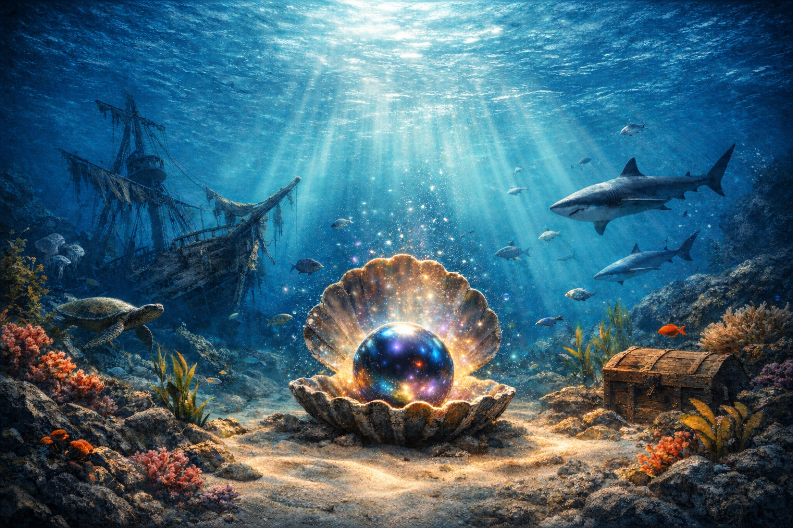

# Охота за жемчужинами 🐚

Небольшая браузерная игра про подводное приключение: собирай жемчужины, лови пузырьки воздуха, уходи от акул и отыщи легендарную **Чёрную жемчужину**.



## Играть

Если включён GitHub Pages, открой сайт:

```
https://<твой-ник>.github.io/<название-репозитория>/
```

Или скачай папку и открой `index.html` в любом современном браузере.

## Управление

- **W A S D** или **стрелки** — движение
- **Пробел** — ускорение в опасных сценах (погоня к пещере, подъём от акул)
- **Esc** — пауза

## Как играть

1. Плавай по океану и собирай жемчужины.
2. Следи за запасом воздуха: лови пузырьки, они продлевают дыхание.
3. Собери **10 жемчужин** — и сможешь отправиться на поиски Чёрной жемчужины.
4. Пройди сцену с пещерой, затонувшим кораблём — и заверши путь глубины.

## Технологии

Всё на чистом HTML5 Canvas + JavaScript, без фреймворков и сборки.

- `index.html` — разметка и оверлеи
- `style.css` — оформление интерфейса и обложки
- `game.js` — игровая логика, рендер, сцены
- `audio.js` — Web Audio API: фоновый шум океана, SFX, динамика
- `cover.png` — стартовая обложка

## Локальный запуск

Просто дважды кликни по `index.html`.
Если браузер ругается на `file://` при загрузке звука/картинок, запусти локальный сервер, например:

```bash
# Python 3
python -m http.server 8000
# затем открой http://localhost:8000
```

## Лицензия

Код — личный проект, используй и меняй по своему усмотрению.
Изображения сгенерированы автором.
